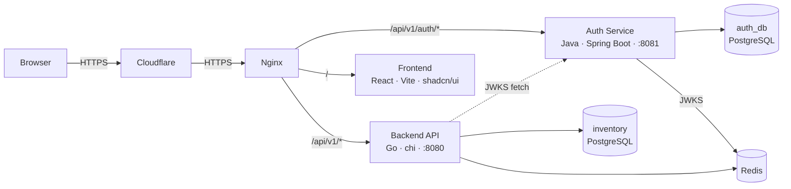

# Inventory Management System

## Architecture



## Tech Stack

| Layer | |
|---|---|
| Frontend | React 19, TypeScript, Vite, TailwindCSS 4, shadcn/ui |
| Backend | Go 1.25, chi, pgx, golang-jwt |
| Auth | Java 21, Spring Boot 4, Spring Security, Nimbus JOSE+JWT, Flyway |
| Database | PostgreSQL 15 (Row-Level Security per tenant) |
| Cache | Redis 7 |
| Proxy | Nginx 1.27 |
| Infra | Docker Compose, Cloudflare, DigitalOcean |

## Run (Dev)

```bash
make docker/up
```

Opens backend `:8080`, auth `:8081`, frontend `:5173`.

## Run (Dev — Native)

```bash
make run
```

Needs PostgreSQL and Redis running locally.

